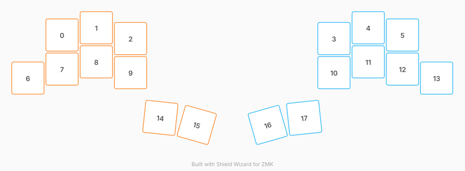

# ZMK Configuration for TwoNr9

*Generated by Shield Wizard for ZMK*



Download compiled firmware from the Actions tab. <https://zmk.dev/docs/user-setup#installing-the-firmware>

Edit your keymap <https://zmk.dev/docs/keymaps>.
User keymap is located at [`config/twonr9.keymap`](config/twonr9.keymap).

-----

<details>
<summary>
Shield Wizard Debug Information
</summary>

In case of broken configuration, here is the Shield Wizard internal data used to generate this configuration:

Commit: 91406f4c7cfc67b0f2b2639a4d61044ae69c7e60

```json
{"name":"TwoNr9","shield":"twonr9","dongle":false,"modules":[],"layout":[{"id":"01KYYJAAGZGBXNNQF9TF6Q68XQ","part":0,"row":0,"col":1,"w":1,"h":1,"x":0.996,"y":0.211,"r":0,"rx":0,"ry":0},{"id":"01KYYJAAGZTP3JE3K7Q65RFGKN","part":0,"row":0,"col":2,"w":1,"h":1,"x":1.996,"y":0,"r":0,"rx":0,"ry":0},{"id":"01KYYJAAGZZH6DS0KCXVTX8M8G","part":0,"row":0,"col":3,"w":1,"h":1,"x":2.996,"y":0.316,"r":0,"rx":0,"ry":0},{"id":"01KYYJAAGZCKVQ53Q659K8SNRR","part":1,"row":0,"col":4,"w":1,"h":1,"x":8.933,"y":0.316,"r":0,"rx":0,"ry":0},{"id":"01KYYJAAGZ4WASQHQ6CGGK44AK","part":1,"row":0,"col":5,"w":1,"h":1,"x":9.933,"y":0,"r":0,"rx":0,"ry":0},{"id":"01KYYJAAGZ9C2XQNFNE7QYS5QD","part":1,"row":0,"col":6,"w":1,"h":1,"x":10.933,"y":0.211,"r":0,"rx":0,"ry":0},{"id":"01KYYJAAGZPE5EN4T4PE9VDJAG","part":0,"row":1,"col":0,"w":1,"h":1,"x":0,"y":1.476,"r":0,"rx":0,"ry":0},{"id":"01KYYJAAGZAX37V05QSQHTS822","part":0,"row":1,"col":1,"w":1,"h":1,"x":0.996,"y":1.211,"r":0,"rx":0,"ry":0},{"id":"01KYYJAAH0TC5PV7HYB4YHHNG9","part":0,"row":1,"col":2,"w":1,"h":1,"x":1.996,"y":1,"r":0,"rx":0,"ry":0},{"id":"01KYYJAAH0SQBT6RGTDQ1YWXZ3","part":0,"row":1,"col":3,"w":1,"h":1,"x":2.996,"y":1.316,"r":0,"rx":0,"ry":0},{"id":"01KYYJAAH0CMWJN7GHNMDMNZ7A","part":1,"row":1,"col":4,"w":1,"h":1,"x":8.933,"y":1.316,"r":0,"rx":0,"ry":0},{"id":"01KYYJAAH0XPN3K59E885BTAK7","part":1,"row":1,"col":5,"w":1,"h":1,"x":9.933,"y":1,"r":0,"rx":0,"ry":0},{"id":"01KYYJAAH0JQX3FPDEKAYQ59T2","part":1,"row":1,"col":6,"w":1,"h":1,"x":10.933,"y":1.211,"r":0,"rx":0,"ry":0},{"id":"01KYYJAAH00SZHD00R43JW0GM8","part":1,"row":1,"col":7,"w":1,"h":1,"x":11.929,"y":1.476,"r":0,"rx":0,"ry":0},{"id":"01KYYJAAH0JZJ9XB5QCQ5R5ZJQ","part":0,"row":2,"col":2,"w":1,"h":1,"x":3.865,"y":2.642,"r":6,"rx":4.365,"ry":3.142},{"id":"01KYYJAAH02DJ5M0TE0770900T","part":0,"row":2,"col":3,"w":1,"h":1,"x":4.929,"y":2.849,"r":16,"rx":5.429,"ry":3.349},{"id":"01KYYJAAH08QMMRG6ZRCK7V7NC","part":1,"row":2,"col":4,"w":1,"h":1,"x":7,"y":2.849,"r":-16,"rx":7.5,"ry":3.349},{"id":"01KYYJAAH0EJDZ2XV2Y5V3HD8H","part":1,"row":2,"col":5,"w":1,"h":1,"x":8.063,"y":2.642,"r":-6,"rx":8.563,"ry":3.142}],"parts":[{"name":"left","controller":"nice_nano_v2","pins":{"d16":{"usage":"kscan","kscan":"01KYYJFZKGPFJS5X3TP2BWSY9W","role":"input"},"d14":{"usage":"kscan","kscan":"01KYYJFZKGPFJS5X3TP2BWSY9W","role":"input"},"d15":{"usage":"kscan","kscan":"01KYYJFZKGPFJS5X3TP2BWSY9W","role":"input"},"d18":{"usage":"kscan","kscan":"01KYYJFZKGPFJS5X3TP2BWSY9W","role":"input"},"d19":{"usage":"kscan","kscan":"01KYYJFZKGPFJS5X3TP2BWSY9W","role":"input"},"d20":{"usage":"kscan","kscan":"01KYYJFZKGPFJS5X3TP2BWSY9W","role":"input"},"d2":{"usage":"kscan","kscan":"01KYYJFZKGPFJS5X3TP2BWSY9W","role":"input"},"d3":{"usage":"kscan","kscan":"01KYYJFZKGPFJS5X3TP2BWSY9W","role":"input"},"d21":{"usage":"kscan","kscan":"01KYYJFZKGPFJS5X3TP2BWSY9W","role":"input"}},"kscans":[{"kind":"direct","id":"01KYYJFZKGPFJS5X3TP2BWSY9W","mode":"gnd"}],"keys":{"01KYYJAAH02DJ5M0TE0770900T":{"input":"d3"},"01KYYJAAH0JZJ9XB5QCQ5R5ZJQ":{"input":"d2"},"01KYYJAAGZPE5EN4T4PE9VDJAG":{"input":"d16"},"01KYYJAAGZAX37V05QSQHTS822":{"input":"d14"},"01KYYJAAH0TC5PV7HYB4YHHNG9":{"input":"d15"},"01KYYJAAH0SQBT6RGTDQ1YWXZ3":{"input":"d21"},"01KYYJAAGZZH6DS0KCXVTX8M8G":{"input":"d20"},"01KYYJAAGZTP3JE3K7Q65RFGKN":{"input":"d18"},"01KYYJAAGZGBXNNQF9TF6Q68XQ":{"input":"d19"}},"encoders":[],"buses":{}},{"name":"right","controller":"nice_nano_v2","pins":{"d2":{"usage":"kscan","kscan":"01KYYJR4V8SXWB1J48DBNVECWK","role":"input"},"d3":{"usage":"kscan","kscan":"01KYYJR4V8SXWB1J48DBNVECWK","role":"input"},"d4":{"usage":"kscan","kscan":"01KYYJR4V8SXWB1J48DBNVECWK","role":"input"},"d5":{"usage":"kscan","kscan":"01KYYJR4V8SXWB1J48DBNVECWK","role":"input"},"d6":{"usage":"kscan","kscan":"01KYYJR4V8SXWB1J48DBNVECWK","role":"input"},"d7":{"usage":"kscan","kscan":"01KYYJR4V8SXWB1J48DBNVECWK","role":"input"},"d8":{"usage":"kscan","kscan":"01KYYJR4V8SXWB1J48DBNVECWK","role":"input"},"d21":{"usage":"kscan","kscan":"01KYYJR4V8SXWB1J48DBNVECWK","role":"input"},"d20":{"usage":"kscan","kscan":"01KYYJR4V8SXWB1J48DBNVECWK","role":"input"}},"kscans":[{"kind":"direct","id":"01KYYJR4V8SXWB1J48DBNVECWK","mode":"gnd"}],"keys":{"01KYYJAAH0CMWJN7GHNMDMNZ7A":{"input":"d2"},"01KYYJAAGZCKVQ53Q659K8SNRR":{"input":"d3"},"01KYYJAAGZ4WASQHQ6CGGK44AK":{"input":"d5"},"01KYYJAAGZ9C2XQNFNE7QYS5QD":{"input":"d4"},"01KYYJAAH0XPN3K59E885BTAK7":{"input":"d6"},"01KYYJAAH0JQX3FPDEKAYQ59T2":{"input":"d7"},"01KYYJAAH00SZHD00R43JW0GM8":{"input":"d8"},"01KYYJAAH0EJDZ2XV2Y5V3HD8H":{"input":"d21"},"01KYYJAAH08QMMRG6ZRCK7V7NC":{"input":"d20"}},"encoders":[],"buses":{}}]}
```

</details>
